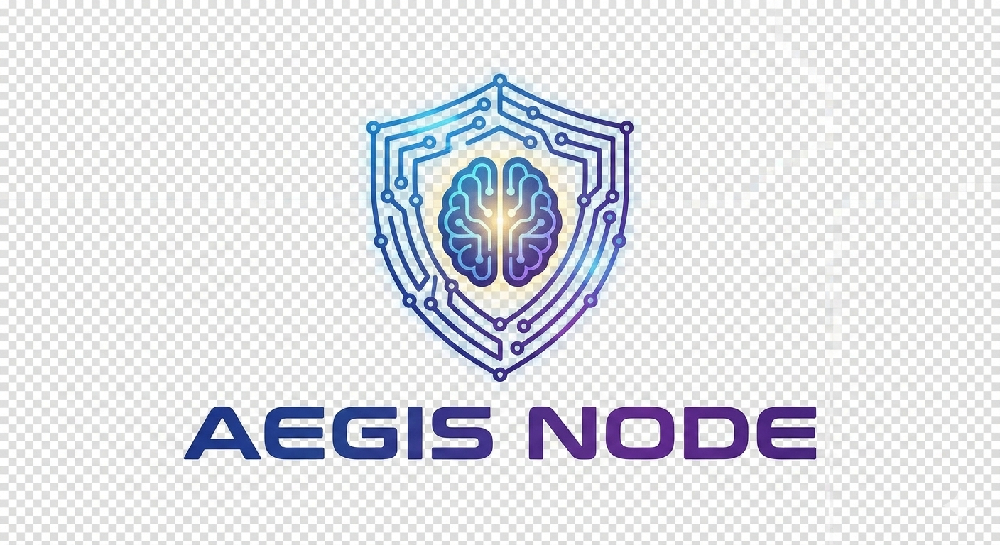
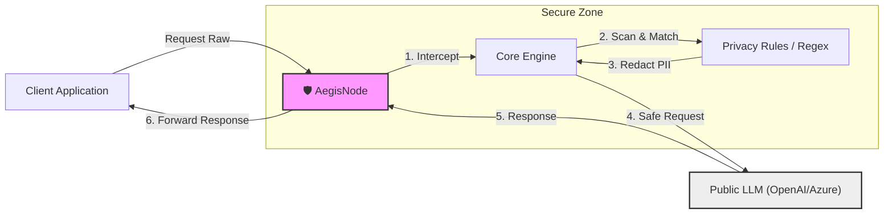

<div align="center">
  
  <h1>AegisNode</h1>
</div>

[](https://opensource.org/licenses/Apache-2.0)
[](https://github.com/yourusername/aegis-node)
[](https://www.rust-lang.org)
[](https://www.cncf.io/sandbox-projects/)

**AegisNode** is a high-performance *reverse proxy* solution designed to secure interactions between enterprise applications and public LLM (Large Language Model) service providers like OpenAI. This project acts as a defense layer that scans, filters, and redacts sensitive information (PII) in *real-time* before data leaves your infrastructure.

Developed using **Rust**, AegisNode offers minimal latency with maximum security, ensuring compliance with data privacy regulations without compromising AI utility.

---

## 🏗 System Architecture

Here is the data flow diagram showing how AegisNode protects your data:



---

## 🚀 Key Features

### 🛡️ Data Protection & Security
*   **Real-time PII Redaction**: Automatically detects and redacts sensitive information such as emails, credit card numbers, and IP addresses in request payloads.
*   **Advanced Pattern Matching**: Supports a powerful *Regex* (Regular Expression) engine to define complex sensitive data patterns.
*   **Entity Blocking**: Ability to completely block requests if they contain specific entity keywords (e.g., confidential project names).
*   **Custom Replacement**: Flexible configuration to replace sensitive data with standard placeholders (e.g., `[EMAIL]`, `[CREDIT_CARD]`).

### ⚡ Performance & Scalability
*   **High Performance Rust Core**: Built on `Hyper` and `Tokio`, providing high *throughput* with very low memory *overhead*.
*   **Zero-Copy Networking**: Uses Rust memory management techniques to minimize data copying during request processing.
*   **Stateless Architecture**: Easily scalable horizontally using Kubernetes or standard load balancers.

### 🔌 Integration & Compatibility
*   **LLM Agnostic**: Designed to work with various LLM providers (OpenAI, Anthropic, Azure OpenAI).
*   **Transparent Proxy**: Integration without code changes on the client side; simply point your AI SDK's `base_url` to this proxy.
*   **Configurable Routing**: Easy upstream destination configuration via YAML file.
*   **Kubernetes Sidecar Integration**: Ready to use as a *sidecar container* in Kubernetes Pods, providing transparent protection without changing complex network architectures.

---

## 💎 Benefits & Value Proposition

*   **Regulatory Compliance**: Helps organizations meet data protection standards like **GDPR**, **CCPA**, and other local privacy laws by ensuring sensitive data is never sent to third parties.
*   **Data Loss Prevention (DLP)**: Prevents accidental sending of *secret keys*, *internal IPs*, or customer data by employees to public AI models that might be used for model retraining.
*   **Full Control**: Provides full visibility and control over what data leaves the organization towards AI services.
*   **Cost Efficiency**: Reduces the risk of regulatory fines and reputational damage due to data leakage incidents.
*   **Credential Centralization**: Eliminates the need to distribute LLM API Keys to every client application. Keys are securely managed at the proxy level, reducing the risk of credential leakage (Credential Sprawl).

---

## 📋 Roadmap

For detailed development plans and upcoming features, please refer to [ROADMAP.md](ROADMAP.md).

---

## 🛠 Installation & Usage Guide

### Prerequisites
*   Rust Toolchain (1.75+)
*   Cargo

### Quick Start

1.  **Clone Repository**
    ```bash
    git clone https://github.com/yourusername/aegis-node.git
    cd aegis-node/proxy
    ```

2.  **Configuration**
    Copy the example configuration file and adjust it to your needs:
    ```bash
    cp config.example.yaml config.yaml
    ```
    
    Edit `config.yaml` to add your API Key and privacy rules:
    ```yaml
    destination:
      name: "openai"
      endpoint: "https://api.openai.com/v1"
      api_key: "${OPENAI_API_KEY}"

    rules:
      - name: "email_filter"
        type: "pattern"
        value: "(?i)[a-z0-9._%+-]+@[a-z0-9.-]+\\.[a-z]{2,}"
        action: "redact"
        replace: "[EMAIL]"
    ```

3.  **Run Server**
    ```bash
    cargo run --release
    ```
    The server will run on `http://localhost:8080` (default).

4.  **Testing**
    Send a request through the proxy:
    ```bash
    curl -X POST http://localhost:8080/chat/completions \
      -H "Content-Type: application/json" \
      -d '{
        "model": "gpt-3.5-turbo",
        "messages": [{"role": "user", "content": "Contact me at user@example.com"}]
      }'
    ```
    The proxy will forward the message as: `"Contact me at [EMAIL]"` to OpenAI.

---

## 🤝 Contributing

We welcome contributions from the community! Please follow these steps:

1.  Fork this repository.
2.  Create a new feature branch (`git checkout -b cool-feature`).
3.  Commit your changes (`git commit -m 'Add cool feature'`).
4.  Push to the branch (`git push origin cool-feature`).
5.  Create a Pull Request.

Please read [CONTRIBUTING.md](CONTRIBUTING.md) for detailed contribution guidelines and code standards.

---

## 🔒 Security Policy

If you discover a security vulnerability, please **DO NOT** open a public issue. Please send a report via email to `security@aegisnode.io`. We will respond within 24 hours.

See [SECURITY.md](SECURITY.md) for the full policy.

---

## 📄 License

This project is licensed under the **Apache License 2.0**. See the [LICENSE](LICENSE) file for more information.

---

*Managed with ❤️ by the AegisNode Community.*
